# AI Recruiter - Continuous Calling & ElevenLabs Voice Integration Report

This report documents the architectural, frontend, and backend features implemented for the **AI Recruiter Mock Interview** system, including the complete technology stack and the solutions applied.

## 🏗️ System Architecture

```mermaid
graph TD
    subgraph Client [Client Portal - Browser]
        UI["index.html / CSS"]
        Orch["app.js - Orchestrator"]
        Audio["Web Audio & Media - volume/mic"]
        SR["Web Speech Recognition - continuous transcription"]
        SS["Web Speech Synthesis - native en-IN fallback"]
        Proctor["TensorFlow.js BlazeFace - head-turn / face counts"]
        Events["Event Listeners - blur / fullscreen / extended displays"]
        Avatar["Three.js - 3D Recruiter Avatar lip-sync"]
    end

    subgraph Backend [Express Server - server.js]
        StartAPI["/api/start-interview"]
        SubmitAPI["/api/submit-answer"]
        TtsAPI["/api/tts - TTS Proxy Router"]
        EndAPI["/api/end-interview"]
        LocalSample[("sample.mp3 - springtime cache")]
    end

    subgraph CloudServices [External Cloud APIs]
        Groq["Groq API - evaluation & question engine"]
        ElevenLabs["ElevenLabs API - voice YZHSTqsq1isdXNsFLzBw"]
        GoogleTTS["Google Translate TTS - accent en-in proxy"]
    end

    %% Client Inner Piping
    UI --> Orch
    Orch <--> Audio
    Orch <--> SR
    Orch <--> SS
    Orch <--> Proctor
    Orch <--> Events
    Orch --> Avatar

    %% Client-Server calls
    Orch -- "Start session" --> StartAPI
    Orch -- "Submit answer & get next Q" --> SubmitAPI
    Orch -- "Fetch voice stream" --> TtsAPI
    Orch -- "Compile report & proctor violations" --> EndAPI

    %% Server Internal Logic
    TtsAPI -- "Serve local cache" --> LocalSample
    TtsAPI -- "Fetch ElevenLabs" --> ElevenLabs
    TtsAPI -- "Fetch Google TTS fallback" --> GoogleTTS

    %% AI Integrations
    StartAPI & SubmitAPI & EndAPI <--> Groq
```



---


## 🛠️ Technology Stack & APIs

### Frontend (Client-Side)
- **HTML5 & Vanilla CSS3**: Core responsive layout, glassmorphic UI elements, and transition styling.
- **Vanilla JavaScript (ES6 Modules)**: Orchestrating state, media flows, and user interactions.
- **Web Audio API**: Managing microphone streams, processing gain levels, and rendering visual volume indicators.
- **Web Speech API (SpeechRecognition)**: Transcribing candidate responses continuously with customized parameters.
- **Web Speech API (SpeechSynthesis)**: Providing local text-to-speech fallback, prioritized with natural Indian English (`en-IN`) voice synthesis models.
- **HTML5 Video/Audio Media**: Displaying the camera preview and playing local and proxy-routed text-to-speech output.

### Backend (Server-Side)
- **Node.js**: Asynchronous event-driven JavaScript runtime.
- **Express.js**: Backend framework hosting the application endpoints and routing requests.
- **dotenv**: Environment configuration management for API keys and global settings.
- **Fetch API (Native Node)**: Performing backend integrations with external APIs.

### AI & Third-Party APIs
- **Groq API**: High-speed Large Language Model inference (using models like `llama-3.3-70b-versatile`) to evaluate candidate text responses and generate dynamic technical questions.
- **ElevenLabs Text-to-Speech API**: Synthesizing premium, realistic human voices (specifically using the sales-oriented female voice ID `YZHSTqsq1isdXNsFLzBw`).
- **Google Translate TTS API**: Acting as a reliable multilingual fallback proxy translating text dynamically with localized accents (`tl=en-in`).

---

## 🚀 Key Implemented Features

### 1. Unified Continuous Call Mode (Google Meet Style)
* **Goal**: Provide a hands-free, fluid calling experience.
* **Mechanism**: The microphone remains active during the candidate's turn without manual click-to-speak triggers. 
* **State Guards**: Implemented `safeStartSpeechRecognition()`, `safeStopSpeechRecognition()`, and `safeAbortSpeechRecognition()` using `this.recognitionIsStartingOrRunning` state locks. This completely resolves the browser SpeechRecognition execution crashes caused by asynchronous overlap calls.
* **Mute/Speech Coordination**: Speech recognition is automatically aborted when the recruiter speaks to prevent transcribing the speaker output, resuming immediately afterwards.

### 2. Smart Silence Detection & Idle Timers
* **Smart Silence Auto-Submit (3.0s)**: Once speech is detected, a trailing silence timer is set. If the candidate stops speaking for 3.0 seconds, their answer is automatically submitted.
* **Idle Warning Nudge (15.0s)**: If absolute silence is detected for 15 seconds, a visual alert nudges the candidate to answer.
* **Idle Auto-Skip (30.0s)**: If absolute silence persists for 30 seconds, the question is skipped automatically.

### 3. Voice Accent Localization (Indian English Tone)
* **Client-Side**: Prioritizes local Indian English voices (like Microsoft Neerja/Prabhat or Google en-IN) inside browser SpeechSynthesis.
* **Server-Side**: Configured the Google TTS fallback proxy to fetch audio with `tl=en-in` accent parameters.

### 4. Audio Feedback Echo Mitigation
* **Solution**: Applied the `muted` attribute to `<video id="candidate-webcam">`. Because the camera preview streams both camera video and microphone audio as its `srcObject`, the lack of `muted` attribute caused the speakers to echo the candidate's own voice back into the microphone. Muting the local webcam playback solved this loop feedback cleanly.

### 5. ElevenLabs Integration & High-Quality Speaker Test
* **TTS Route**: Added `/api/tts` in `server.js` to request speech from ElevenLabs API using voice ID `YZHSTqsq1isdXNsFLzBw`.
* **Fallback**: Gracefully falls back to localized Google TTS if `ELEVENLABS_API_KEY` is not present in `.env`.
* **Static File Caching**: Automatically downloaded the high-quality ElevenLabs voice sample `sample.mp3` to `public/` and configured `/api/tts` to intercept requests for the springtime greeting text and serve the local file directly.
* **Lobby Test Voice**: Relabeled the lobby button to **"Test Speaker Voice"** and updated `testSpeaker()` to fetch and play this springtime voice sample, giving developers and users an instant demonstration of the natural ElevenLabs recruiter voice.

---

## 📂 Project Structure

```
c:/31. Avatar-Testing
├── .env                  # Port, Groq & ElevenLabs API keys
├── .env.example          # Template environment configurations
├── package.json          # Node dependency configurations
├── server.js             # Express API server (starts call, submits answer, proxy TTS)
└── public
    ├── index.html        # Main interview portal, device test UI, and coding workspace
    ├── sample.mp3        # Cached high-quality ElevenLabs voice sample file
    ├── css
    │   └── style.css     # Glassmorphism design system, camera proctoring styling
    ├── js
    │   ├── app.js        # Core Orchestrator (safety guards, timers, device selectors)
    │   └── avatar.js     # Three.js 3D avatar animations and lip-sync controllers
    └── images
        └── avatar.jpg    # Recruiter fallback avatar image
```

---

## 🛡️ Proctoring & Anti-Cheating System

The application utilizes a comprehensive client-side proctoring engine with Tensorflow.js models and browser events to log and prevent cheating behaviors:

### 1. Camera Gaze & Face Verification (TensorFlow.js BlazeFace)
- **BlazeFace Model**: Estimations of face coordinate arrays are processed in the background every 1.5 seconds from the candidate's camera stream (`candidateWebcam`).
- **Face Count Check**: 
  - **No Face**: If no faces are estimated for 3.0 consecutive seconds, it triggers a warning.
  - **Multiple Faces**: If more than 1 face is detected for 3.0 consecutive seconds, it triggers a warning.
- **Look Away / Eye Gaze Check (Head Pose Symmetry)**:
  - Extracts three key coordinate landmarks: **Right Eye**, **Left Eye**, and **Nose**.
  - Calculates horizontal distances from the nose:
    - $distLeft = |noseX - leftEyeX|$
    - $distRight = |noseX - rightEyeX|$
  - Computes the symmetry ratio: $ratio = distLeft / distRight$
  - If the candidate turns their head horizontally to look away, the nose shifts closer to one eye, causing a high ratio asymmetry.
  - A ratio **$> 3.0$ or $< 0.33$** held consecutively for 3 frames (4.5 seconds) triggers a **"Looking Away"** warning.

### 2. Browser Environment Monitoring
- **Tab Switched (`visibilitychange` event)**: If the document is minimized or the user switches browser tabs (`document.visibilityState === 'hidden'`), a warning is immediately logged.
- **Application Focus Loss (`blur` event)**: Triggers if the user clicks out of the browser window or navigates to a background application (debounced by 200ms to allow browser setup dialogs).
- **Fullscreen Enforcement (`fullscreenchange` event)**: Exiting mandatory fullscreen mode instantly prompts a warning alert and pauses the session. Fullscreen must be re-enabled to resume.
- **Secondary Display Protection (`window.screen.isExtended`)**: Checked dynamically and polled every 3 seconds. An active secondary monitor or extended screen connection automatically prompts a display violation warning.

### 3. Copy-Paste / Input Interception
- Event handlers on `copy`, `cut`, and `paste` cancel default actions, blocking candidate cheating actions and logging clipboard violation instances.
- Key shortcut interceptors block system manipulation keys (Alt+Tab, Win keys, etc.).

### 4. Violation Termination Rules
- Violation counts are tracked in individual categories in `this.warningCounts`.
- Accumulating **5 warning counts** in any single category triggers immediate session termination, logging the violation, resetting the recruiter status, and returning a score of **0** on the final evaluation report.
